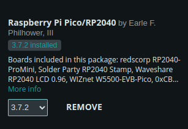
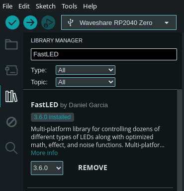
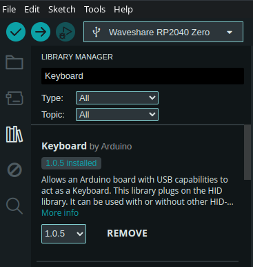
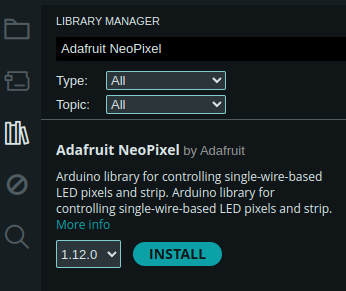

# Programming your own firmware

Using Arduino IDE it is very simple to program your own custom firmware on the ESK. With the information and instructions below, you can easily start programming your ESK for your complicated, niche use case, or simply get your feet wet with programming.

## Arduino IDE

You will need to download and install Arduino IDE to get started. You can find it on their [downloads page here](https://www.arduino.cc/en/software).

### Adding the board

Once you've installed Arduino IDE, you will need to setup the board definition in order to work with the RP2040 microcontroller. You can follow Waveshare's instructions [here](https://www.waveshare.com/wiki/RP2040-Zero). Scroll down just past the arduino IDE installation instructions.



### Adding libraries used in the example

Once you have the board installed, you will also need to download a few dependencies to get the example code to work. You can select the library manager on the left hand side of Arduino IDE to install the libraries.

You will need to install the FastLED library by Daniel Garcia, and the Keyboard library by Arduino in order to compile the firmware.





You could also use the Adafruit NEOPixel by Adafruit as an alternative to FastLED if you are looking for different LED controls.



Now you can copy the contents of the [example_firmware.c](./example_firmware.c) into your `.ino` file.

### Flashing

Once you have inserted the source code into Arduino IDE and you are ready to install your firmware, click the verify button (chaeckmark) in the top left corner of Arduino IDE to (attempt to) compile the firmware. There are currently a few warnings that are thrown (as of 3/9/2024), but it's safe to ignore them as long as you get something like the following at the end of the console output:

```
Sketch uses 61012 bytes (2%) of program storage space. Maximum is 2093056 bytes.
Global variables use 10572 bytes (4%) of dynamic memory, leaving 251572 bytes for local variables. Maximum is 262144 bytes.
```

This indicates the compilation was successful.

Now that you have verified your firmware, you can upload the code to your ESK.

1. Press and hold the boot switch on the ESK (the tactile button on the top that DOES NOT have the marking on it)
2. Press and release the reset switch on the ESK (the tactile button that DOES have the marking on it)
3. Release the boot switch

The timing of this really does not matter, and it can be very quick or slow, but you just need to make sure the boot button is held when the ESK boots up/restarts.

This will put the microcontroller into boot flashing mode. It will ask to be mounted as a removable USB storage device which you will need to allow. Once the removable storage is mounted, you can click Upload (right arrow) in Arduino IDE.

The console will say the following while it is waiting for the mounted storage for the microcontroller.

```
Scanning for RP2040 devices
```

And you will see the following message once the flash has been written to the device.

```
Flashing /media/curtis/RPI-RP2 (RPI-RP2)
Wrote 157696 bytes to /media/curtis/RPI-RP2/NEW.UF2
```

That's it! You should now be able to play use your ESK with your new firmware!

It might be worth noting that you can also click Upload  before performing the boot/reset steps. As long as you are quick enough before the upload script times out, you should be good to go.